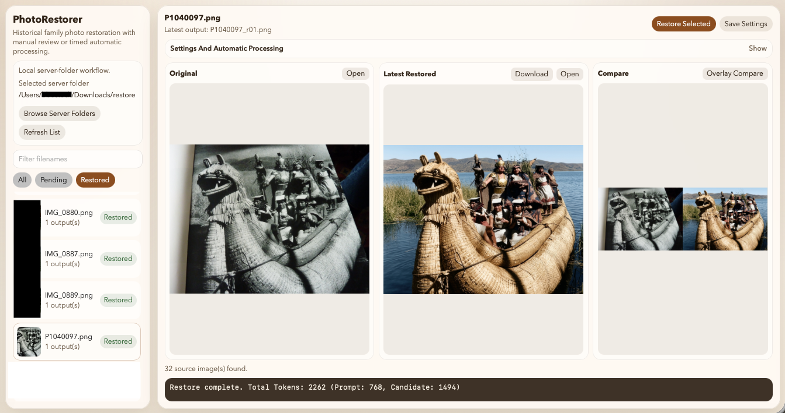
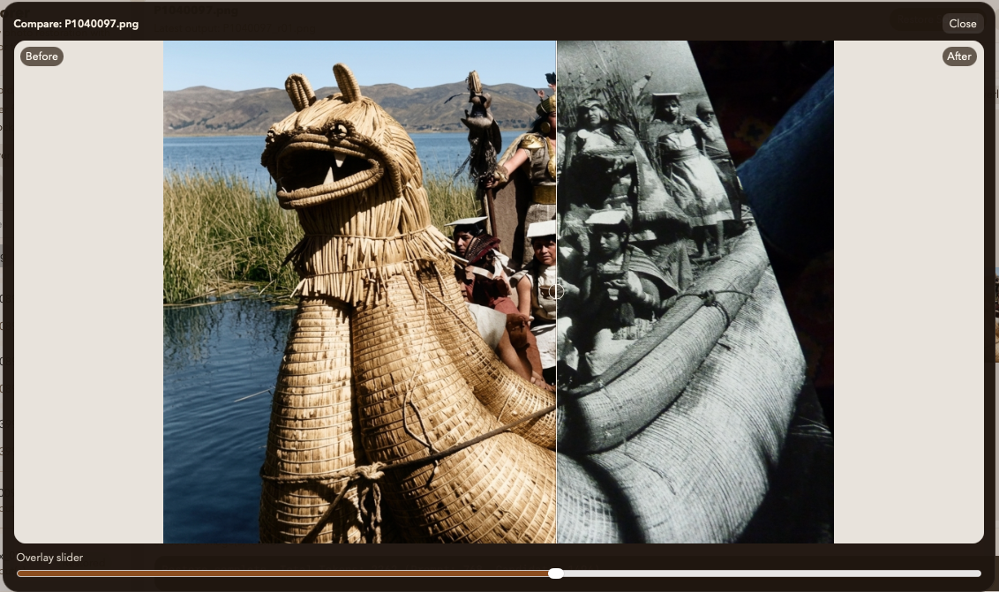

# PhotoRestorer

PhotoRestorer now has two deployment targets:

- `family_restore_server.py`: local/LAN standalone server for your own server-folder workflow
- `passenger_wsgi.py` + `family_restore_hosted_wsgi.py`: hosted upload-only app for cPanel/Passenger

Both variants use the same [family_restore_gui.html](/Users/bbostock/PhotoRestorer/family_restore_gui.html).

## Python packages

Install the Python packages from [requirements.txt](/Users/bbostock/PhotoRestorer/requirements.txt) into a virtual environment:

```bash
python3 -m venv .venv
source .venv/bin/activate
pip install -r requirements.txt
```

The only Python packages currently required are:

- `google-genai`
- `Pillow`

## Local app

Use this when you want to browse folders on your own machine or LAN server and save restored files beside the originals.

Run:

```bash
python3 family_restore_server.py
```

Then open:

- `http://127.0.0.1:8765/family_restore_gui.html`
- or the printed LAN URL

Local behavior:

- server-side folder browser
- one folder at a time
- restored files saved beside originals as `_r01`, `_r02`, and so on
- settings persisted in `family_restore_prompt_config.json`

### Local first use

When the local app opens for the first time:

1. Enter your Gemini API key if you are not using a server-wide `GOOGLE_API_KEY`.
2. Click `Browse Server Folders`.
3. Choose the folder that contains the photos you want to work on.
4. Select an image from the list.
5. Optionally upload one or two clearer same-person reference photos.
6. Adjust `Prompt`, `Extra note`, `Colorize`, `Overwrite latest _rNN`, and automatic-processing settings.
7. Click `Restore Selected`.

For local use, restored files are written beside the originals as:

- `<stem>_r01.png`
- `<stem>_r02.png`
- and so on

Automatic processing:

- set `Auto pause seconds` to `0` for manual use
- set it above `0` to process the folder sequentially with a pause between images

### Example workflow

Example of the local restoration workflow with the original, latest restored result, and compare panel visible:



Example of the compare overlay view for checking the restored result against the source image:



## Hosted cPanel app

Use this when the app is hosted for other users. In this mode:

- users upload their own target photos
- users upload their own same-person reference photos
- users provide their own Gemini API key in the browser
- no browsing of your server folders
- uploaded files live only in a temporary server-side session area
- restored results are downloaded individually

### Hosted first use

When the hosted app opens for the first time:

1. Enter your own Gemini API key in the app.
2. Click `Upload Target Photos` and choose the photo or photos you want to restore.
3. Select one uploaded image from the list.
4. Optionally upload one or two clearer same-person reference photos.
5. Adjust `Prompt`, `Extra note`, `Colorize`, `Overwrite latest _rNN`, and automatic-processing settings.
6. Click `Restore Selected`.
7. Use the `Download` button on the restored panel to save the result.

Hosted behavior:

- uploaded target and reference images are tied to the current browser session
- users do not browse server folders
- users bring their own Gemini API key
- restored outputs are downloaded individually rather than written into a server photo folder

### HostPresto / cPanel values

These are the values that worked with HostPresto's CloudLinux/LiteSpeed setup:

- `Python version`: `3.12.12` or the exact Python 3 version you intend to keep
- `Application root`: `public_html/photorestorer`
- `Application URL`: `bostock.com / photorestorer`
- `Application startup file`: `passenger_wsgi.py`
- `Application Entry point`: `application`

Important:

- create the app with the final Python version from the start
- do not create it as Python 2.7 and then switch it later
- cPanel may generate its own initial `passenger_wsgi.py`; after creation, replace it with [passenger_wsgi.py](/Users/bbostock/PhotoRestorer/passenger_wsgi.py)

### Files to upload into the hosted app root

Upload these files into `/home/<cpanel-user>/public_html/photorestorer`:

- [passenger_wsgi.py](/Users/bbostock/PhotoRestorer/passenger_wsgi.py)
- [family_restore_hosted_wsgi.py](/Users/bbostock/PhotoRestorer/family_restore_hosted_wsgi.py)
- [family_restore_server.py](/Users/bbostock/PhotoRestorer/family_restore_server.py)
- [family_restore_gui.html](/Users/bbostock/PhotoRestorer/family_restore_gui.html)
- [requirements.txt](/Users/bbostock/PhotoRestorer/requirements.txt)

Do not upload `family_restore_prompt_config.json` for the hosted app.

### HostPresto deployment order

1. Create the Python app in cPanel with the values above.
2. Wait for cPanel to create the app root and virtualenv.
3. Upload the files listed above into `public_html/photorestorer`.
4. If cPanel generated a starter `passenger_wsgi.py`, replace it with the repo copy.
5. Install the Python packages from `requirements.txt`.

If the cPanel `Run Pip Install` button is silent or unreliable, use SSH instead:

```bash
source /home/<cpanel-user>/virtualenv/public_html/photorestorer/3.12/bin/activate
cd /home/<cpanel-user>/public_html/photorestorer
pip install -r requirements.txt
```

6. Start the app from cPanel.
7. Open the hosted URL.

### Required `.htaccess` Passenger mapping

On HostPresto, the Python app did not always write the Passenger directives correctly. If the site shows a directory listing instead of the app, make sure `/home/<cpanel-user>/public_html/photorestorer/.htaccess` contains:

```apache
PassengerAppRoot "/home/<cpanel-user>/public_html/photorestorer"
PassengerBaseURI "/photorestorer"
PassengerPython "/home/<cpanel-user>/virtualenv/public_html/photorestorer/3.12/bin/python"

<IfModule LiteSpeed>
</IfModule>
```

Then restart Passenger:

```bash
mkdir -p /home/<cpanel-user>/public_html/photorestorer/tmp
touch /home/<cpanel-user>/public_html/photorestorer/tmp/restart.txt
```

### Debugging HostPresto failures

If the hosted app returns `503`, the first file to inspect is:

```bash
tail -100 /home/<cpanel-user>/public_html/photorestorer/stderr.log
```

Two failure modes were seen during setup:

- stale Python 2.7 wrapper state after changing Python versions
- missing Passenger directives in `.htaccess`, which caused LiteSpeed to serve a directory listing instead of the app

### Hosted Gemini key behavior

For the hosted app, the recommended setup is:

- leave `GOOGLE_API_KEY` unset on the server
- each user enters their own Gemini API key in the app

The Gemini API key field is stored only in that user's browser and is sent only with that user's restore requests.

### Prompt and reference guidance

For both local and hosted use:

- the target photo defines the layout, pose, framing, and scene
- same-person reference photos are for identity, hair, clothing, and person detail only
- references should not be used to replace the target photo's composition
- use `Extra note` when you need to name the people and clarify who is where in the target image

A good pattern for `Extra note` is:

```text
The target photo contains Mum, Bill (2), Sue (4), and Peter (6). Keep the exact layout and positions from the target image. Use the reference photos only to recover the appearance of these same people.
```

## Notes

- Temporary reference uploads, hosted target uploads, and compare previews are stored in the system temp directory, not in this repo.
- Token usage logs are written under `logs/`.
- The shared UI now uses path-safe API URLs, so it can run under a cPanel subpath like `/photorestorer`.
